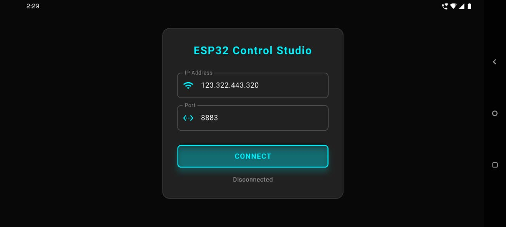
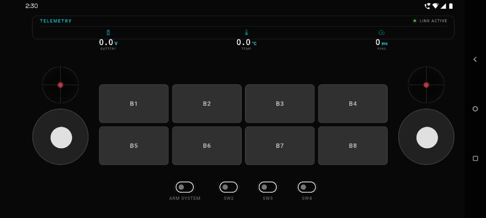
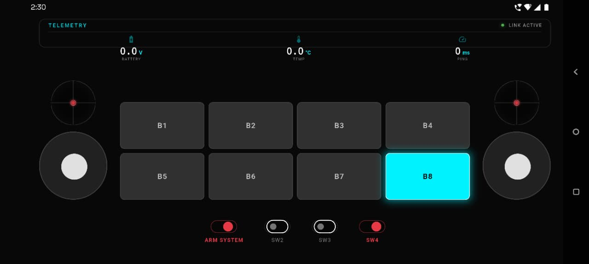

# 🎮 ESP32 Control Studio

[](https://flutter.dev)
[](https://www.espressif.com/en/products/socs/esp32)
[](https://opensource.org/licenses/MIT)

A professional-grade Flutter application designed for high-performance, real-time control and telemetry monitoring of ESP32-based robotics and IoT devices.

---

## ✨ Features

- ⚡ **Real-time Telemetry**: Monitor battery voltage, system temperature, and connection ping in real-time.
- 🕹️ **Dual-Joystick Control**: Precise analog control for movement and auxiliary systems.
- 🔴 **System Arming**: Safety-first approach with a dedicated system arming toggle.
- 🔘 **Custom Command Buttons**: 8 programmable buttons for triggering specific device actions.
- 🌐 **UDP Protocol**: Low-latency communication optimized for real-time responsiveness.

---

## 📸 Screenshots

| Connection Screen | Control Panel (Idle) | Control Panel (Active) |
| :---: | :---: | :---: |
|  |  |  |

---

## 🚀 Getting Started

### 📱 Flutter Application
1. **Prerequisites**: [Flutter SDK](https://docs.flutter.dev/get-started/install) installed.
2. **Setup**:
   ```bash
   cd app/control_studio
   flutter pub get
   ```
3. **Run**:
   ```bash
   flutter run
   ```

### 🔌 ESP32 Firmware
- The firmware expects a UDP server listening for control packets and broadcasting telemetry data.
- Default Port: `8883`

---

## 🛠️ Project Structure

- `/app/control_studio`: The core Flutter application.
- `/docs`: Technical documentation and assets.
- `mock_server.dart`: A Dart-based mock server for testing the app without physical hardware.
- `mock_esp32_server.py`: A Python-based mock server for cross-platform validation.

---

## 📜 Protocol Specification

The system uses a custom binary protocol over UDP for maximum efficiency.

| Packet Type | Description | Frequency |
| :--- | :--- | :--- |
| **Control** | Joystick positions, button states, switches | 20Hz - 50Hz |
| **Telemetry** | Battery, Temp, System Status | 5Hz - 10Hz |

---

## 🤝 Contributing

Contributions are welcome! Please feel free to submit a Pull Request.

---

## ⚖️ License

This project is licensed under the MIT License - see the [LICENSE](LICENSE) file for details.
