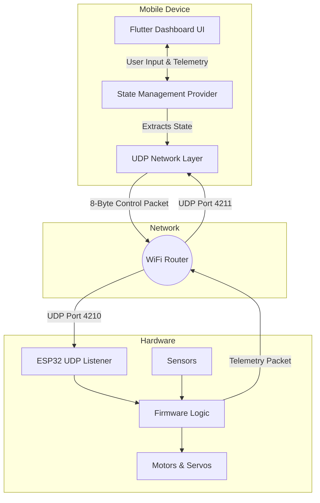
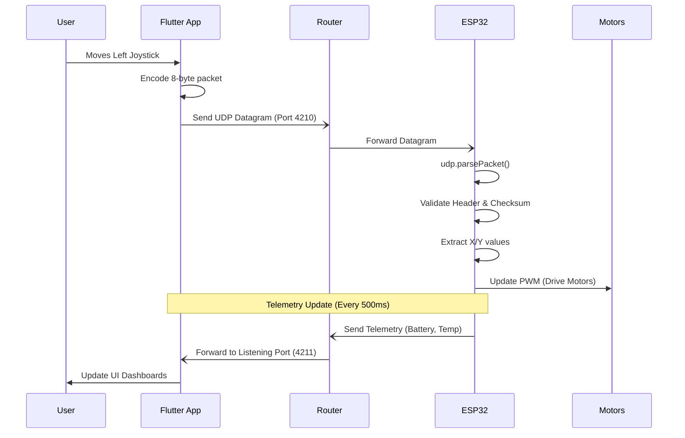

# System Architecture

The ESP32 Control Studio is designed with a clear separation of concerns, ensuring high performance, low latency, and easy integration. 

## System Overview

The system consists of the mobile application (Flutter) acting as the transmitter, the local WiFi network acting as the transport layer, and the ESP32 microcontroller acting as the receiver and actuator.



## Layered Architecture

The application itself is structured into distinct layers to promote maintainability:


*(Note: Mermaid architecture diagrams offer a structural view. The layers translate to `/screens`, `/providers`, and `/services` inside the Flutter codebase.)*

## Network Packet Flow

The system uses a highly optimized packet flow. Due to the nature of UDP, packets are sent asynchronously without waiting for handshakes. 



## App State Architecture

Inside the Flutter application, state is managed entirely through the `Provider` package to prevent unnecessary UI rebuilds.

```mermaid
flowchart LR
    Widget1[JoystickWidget] -->|updateJoystick()| Provider[ControllerState Provider]
    Widget2[ToggleSwitchWidget] -->|updateToggle()| Provider
    
    Provider -->|notifyListeners()| UI[DashboardScreen]
    Provider -->|Timer Loop| UDPService[UDP Service]
    UDPService -->|Sends Data| Network
```

This ensures that UI components like buttons and joysticks only interact with the unified state, which acts as the single source of truth for generating the outgoing datagrams.
