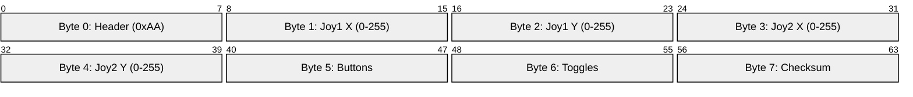

# UDP Control Protocol

ESP32 Control Studio uses a highly optimized, fixed-length 8-byte UDP packet to ensure minimal parsing time on the embedded hardware side. This is essential for maintaining control loop frequencies above 50Hz without blocking the main device loop.

## Packet Structure Diagram



## Byte Breakdown

### Byte 0 Header `[0xAA]`
Used simply to quickly discard garbage network packets. If `packet[0] != 0xAA`, ignore it immediately.

### Bytes 1-4: Joysticks
Analog joysticks map coordinates to a generic 0 - 255 unsigned byte.
- `0`: Full Left / Full Bottom
- `128`: Center (Deadzone)
- `255`: Full Right / Full Top

The application automatically handles rounding and bounding.

### Byte 5: Button Bitmask `[0x00 - 0x0F]`
Buttons are encoded as a bitmask to save space. Multiple buttons can be pressed simultaneously.

| Button | Bit Index | Hex Mask |
|--------|-----------|----------|
| A      | 0         | `0x01`   |
| B      | 1         | `0x02`   |
| X      | 2         | `0x04`   |
| Y      | 3         | `0x08`   |

*Example: If A and X are pressed, Byte 5 will be `0x05`.*

### Byte 6: Toggle Bitmask `[0x00 - 0x0F]`
Toggles retain their state. Like buttons, they are encoded into bits 0 through 3.

| Toggle | Bit Index | Hex Mask |
|--------|-----------|----------|
| T1     | 0         | `0x01`   |
| T2     | 1         | `0x02`   |
| T3     | 2         | `0x04`   |
| T4     | 3         | `0x08`   |

### Byte 7: XOR Checksum
Used to verify data integrity over the noisy UDP connection. 
To compute it on the ESP32 side, simply XOR bytes 0 through 6 together:

```cpp
byte checksum = 0;
for (int i = 0; i < 7; i++) {
  checksum ^= packet[i];
}
```
If the computed checksum matches `packet[7]`, the joystick and button values are safe to act upon.

## Network Transmission Details
- **Transmission Rate:** The Flutter app sends this exactly 8-byte payload continuously at a target 50Hz rate when joysticks are active.
- **Port Strategy:** The target device must listen on port `4210`.
- **Latency Guarantee:** Because UDP has no handshake or guaranteed delivery overhead, packet transit times on local 2.4GHz WiFi usually fall under 5ms-15ms.
